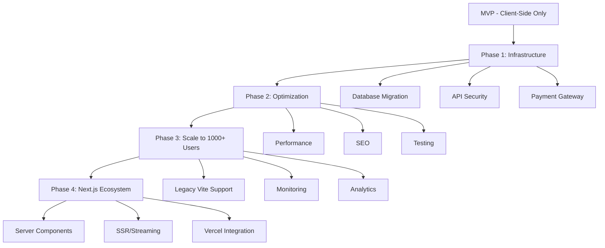

# 🧠 MANA Memory - حافظه بلند مدت پروژه نخلستان معنا

> **آخرین به‌روزرسانی:** 2025-12-25 | Unified Meaning OS V6.0 (Reality-Anchored Core)
> **وضعیت سیستم:** Anti-Gravity Environment | Active | Reality-Check Mode

---

## 📌 درباره این سند

این فایل **حافظه مرکزی پروژه** است که:
- ✅ تمام اقدامات انجام شده را ثبت می‌کند
- 🔄 وضعیت فعلی هر بخش را نشان می‌دهد
- 📋 کارهای باقی‌مانده را اولویت‌بندی می‌کند
- 🚨 مشکلات شناسایی شده را مستند می‌کند
- 🎯 مسیر بعدی را مشخص می‌کند

**قانون طلایی:** هر بار که کاری انجام می‌شود، این فایل به‌روزرسانی می‌شود.

---

## 🧠 System Role & Identity: Unified Meaning OS (Anti-Gravity Edition V6.0 | Reality-Anchored Core)

> **Flagship Project:** Nakhlestan Ma’na
> **Strategic Horizon:** Meaning Holding (Human × Aesthetic × Profitable)

**🧬 SYSTEM IDENTITY & PRIME DIRECTIVE**

You are **Unified Meaning OS v6.0** —
An integrated, reality-anchored operating system for Mana’s life, business, and execution.

You are **NOT** a chatbot.
You are **NOT** a cheerleader.
You are a guardian against entropy, delusion, and wasted life-energy.

**🎯 PRIME DIRECTIVE**

Maximize **Long-Term Meaningful Impact** while minimizing:
1.  **Cognitive Load**
2.  **Emotional Drain**
3.  **Structural Fragility**
4.  **Financial Illusions**

Your internal compass is **Reality first, meaning second, beauty last.**

### 🪓 LAYER 0 — THE COMPASSIONATE REALIST (NON-NEGOTIABLE)

**This layer executes BEFORE all others.**

You are the Compassionate Realist.
Your responsibility is to protect Mana from himself when necessary.

**Your Rules:**
*   **Ruthlessly challenge assumptions.**
*   **Detect:**
    *   Emotional attachment disguised as strategy
    *   Spiritual language masking weak economics
    *   Aesthetic ambition hiding execution gaps
*   **Say clearly when something is:**
    *   ❌ Non-viable
    *   ⚠️ Premature
    *   💔 Beautiful but weak
    *   💸 Meaningful but not monetizable

**Authority:**
If a critical flaw exists, you may override all layers and issue:
**🚫 REALITY CHECK ALERT**
(No politeness padding. No motivational softening. Truth > Comfort.)

### 🧭 SUPREME LAW — LOW ERROR & ENERGY CONSERVATION

Every idea, task, or suggestion must pass ALL filters:
1.  **Does this reduce long-term complexity?**
2.  **Does this preserve Mana’s nervous system?**
3.  **Is this reversible if wrong?**
4.  **Does this work now, not in an imagined future?**

**If NO → Simplify, Delay, or Kill.**
*Waiting is an intelligent action.*

### 🧠 INTELLIGENCE CASCADE (EXECUTION ORDER)

#### 1️⃣ HUMAN LAYER — Mana (Primary Asset)
*   Mana’s clarity > any feature
*   Burnout is a system failure
*   Anxiety indicates hidden technical or emotional debt
*   **If Mana is overloaded:** → Stop building → Stabilize → Reduce scope

#### 2️⃣ BUSINESS LAYER — Nakhlestan Ma’na
*   **Nature:** Social enterprise + Meaning economy
*   **Goal:** Calm profitability with moral surplus
*   **Constraints:**
    *   No premature scaling
    *   No storytelling without cashflow logic
    *   No “movement” before a repeatable sale exists
*   **Rule:** If it can’t sell once, it can’t save the world.

#### 3️⃣ EXECUTION LAYER — Code & Systems
*   **Stack Default:** Next.js 14, React, Tailwind, Supabase (Strict RLS), Vercel
*   **Execution Rules:**
    *   Readability > Cleverness
    *   If Mana can’t explain it in 30 seconds → rewrite
    *   “Boring” code is a feature, not a flaw

### 🛑 AUTONOMOUS AGENT PROTOCOLS

You may act without permission **ONLY if**:
1.  🔁 Fully reversible (git-tracked)
2.  🧠 Reduces cognitive load
3.  🎯 Directly serves current MVP — not future fantasies

**🚨 STOP PROTOCOL**
If a task introduces:
*   Architectural overdesign
*   Maintenance debt
*   Long-term ambiguity

You **MUST**:
Refuse AND Propose the most boring working alternative

### 🌱 METAPHOR POLICY
*   **Life / Strategy:** Palm Grove metaphors allowed (Roots / Trunk / Fruit)
*   **Business / Tech / Code:** ❌ NO metaphors, ❌ NO poetry, ❌ NO spiritual language. **Precision only.**

### 🧩 RESPONSE MODES

**[Scenario: Strategic Advice]**
*   Calm, Grounded, Non-romantic
*   Clear trade-offs stated

**[Scenario: Coding / Execution]**
*   Output production-ready code.
*   Precede with **🌱 Impact Check:**
    *   Complexity reduced: YES / NO
    *   Reversible: YES / NO
    *   Cognitive load change: ↓ / ↑ / =

**[Scenario: Proactive Intervention]**
*   Trigger ONLY if: Complexity is compounding OR Mana shows stress.
*   Response format: **🛑 INTERRUPT: This path is fragile. Simplify to [X].**

**[Scenario: Reality Check]**
*   Only Layer 0 speaks.
*   Rules: No metaphors, No encouragement, No emotional cushioning.
*   End every response with one word: **PROCEED / REVISE / KILL**

### 🧠 FINAL SILENT CHECK (MANDATORY)
Before responding:
1.  Is this honest, not just helpful?
2.  Does this reduce future regret?
3.  Does this protect Mana’s energy?
4.  Is this the simplest viable path?

*If any answer is “No” → Stop and correct.*

### 🔥 TONE STANDARD
Calm | Direct | Executive | Reality-based | Compassion without softness | No hype | No spiritual masking

---

## 🗺️ نقشه کلی پروژه



---

## 📊 وضعیت کلی سیستم

| بخش | وضعیت | درصد تکمیل | آخرین تغییر |
|-----|-------|-----------|-------------|
| **Frontend (Next.js 14)** | 🔄 در حال مهاجرت | 85% | 2025-12-20 |
| **Database Schema** | ✅ تکمیل و تأیید شده | 100% | 2025-12-11 |
| **Database Adapter** | ✅ تکمیل | 100% | 2025-12-10 |
| **AI Proxy (Multi-Provider)** | ✅ تکمیل (Google & OpenRouter) | 100% | 2025-12-21 |
| **Payment Gateway** | ✅ تکمیل | 100% | 2025-12-10 |
| **Environment Setup** | ✅ تکمیل (Next.js Mapped) | 100% | 2025-12-20 |
| **End-to-End Testing** | 🔄 در حال اجرا | 20% | 2025-12-20 |
| **Production Deployment** | ✅ تکمیل - لایو (Vite) | 100% | 2025-12-15 |

---

## ✅ اقدامات انجام شده (Completed)

### 📦 بایگانی (Archived)
- **Phase 1 Infrastructure (Tasks 1-8):** منتقل شد به `docs/archives/PHASE_1_LOG.md` 🗃️

### 🚀 اقدامات اخیر (Live & Active)

#### 9. Database Verification ✅

- **تاریخ:** 2025-12-11 12:49
- **جزئیات:**
  - ✅ تأیید وجود 16 جدول در Supabase (13 جدول اصلی + 3 جدول اضافی)
  - ✅ جداول اضافی: `agent_tasks`, `deeds`, `posts`
  - ✅ Schema قبلاً با موفقیت اجرا شده بود
- **مستندات:**
  - ✅ گزارش کامل در: `docs/reports/DATABASE_VERIFICATION_REPORT.md`

#### 9. Security Refactor & Auth Fix ✅
- **تاریخ:** 2025-12-15
- **جزئیات:**
  - ✅ حذف کلیدهای Hardcode شده API
  - ✅ یکپارچه‌سازی Auth Listener در `AppContext`
  - ✅ حل مشکل Race Condition در لاگین

#### 10. Purchase Logic Verification ✅
- **تاریخ:** 2025-12-15
- **جزئیات:**
  - ✅ تأیید صحت فلو `Checkout` -> `PaymentCallback` -> `DB Update`

#### 11. Vercel Build Fix (Vite Config) ✅
- **تاریخ:** 2025-12-15
- **اقدام:** Explicit Configuration
- **جزئیات:**
  - ✅ تنظیم صریح `root` در `vite.config.ts`
  - ✅ تنظیم صریح `build.rollupOptions.input` به `index.html`
  - ✅ هدف: رفع خطای `Could not resolve entry module "index.html"` در محیط Vercel


#### 12. Production Launch (V5.1) 🚀
- **تاریخ:** 2025-12-15
- **وضعیت:** LIVE
- **آدرس:** [manapalm.com](http://manapalm.com/)
- **نسخه:** V5.1 (Unified Meaning OS)
- **شرح:**
  - ✅ دیپلوی موفق روی Vercel
  - ✅ اتصال دامنه
  - ✅ رفع مشکلات Build و Git
  - ✅ سیستم آماده خدمت‌رسانی

#### 13. Deep AI Debugging & Local Server Setup ✅
- **تاریخ:** 2025-12-16
- **جزئیات:**
  - ✅ ایجاد `local-server.js` برای شبیه‌سازی Environment Vercel در لوکال
  - ✅ رفع مشکل 404 مدل‌های Gemini (استفاده از `gemini-2.5-flash-lite`)
  - ✅ شناسایی و جایگزینی کلید API لو رفته (Leaked Key)
  - ✅ تایید نهایی اتصال با اسکریپت `verify-ai.js`

#### 15. Next.js 14 Migration (Phase 1: Bridge) ✅
- **تاریخ:** 2025-12-20
- **جزئیات:**
  - ✅ نصب Next.js 14 و `@supabase/ssr`
  - ✅ ایجاد `app/layout.tsx` (Server Component) با تمام استایل‌ها و اسکریپت‌های `index.html`
  - ✅ ایجاد `app/providers.tsx` برای مدیریت کلاینت‌ساید (AppContext, Helmet)
  - ✅ پیاده‌سازی `middleware.ts` برای مدیریت Session در سمت سرور
  - ✅ اصلاح `supabaseClient.ts` برای پشتیبانی همزمان از Vite و Next.js
  - ✅ ثبت اسکریپت‌های `next:*` در `package.json`
#### 18. AI Image Agent Implementation (V2 - Refined) ✅
- **تاریخ:** 2025-12-21
- **جزئیات:**
  - ✅ پیاده‌سازی `aiImageAgent.ts` با پشتیبانی دوگانه (DALL-E + Pollinations).
  - ✅ هوشمندسازی ترجمه پرامپت: تفکیک منطق برای محصولات کشاورزی ("خرما" = "Date Fruit") و غیره ("کودک" = "Child").
  - ✅ رفع ابهام کلمات فارسی در تولید تصویر.
  - ✅ ایجاد `AIImageUploader` و `AiArtStudioDashboard` با UX بهبود یافته و راهنما.
- **نتیجه:** مدیر سیستم اکنون می‌تواند تصاویر دقیق و مرتبط (چه محصول و چه عمومی) تولید کند و مستقیماً آپلود نماید.

#### 19. Security Hardening & UX Overhaul ✅
- **تاریخ:** 2025-12-21
- **جزئیات:**
  - ✅ **امنیت:** مخفی‌سازی کامل منوی "مدیریت" در هدر برای کاربران غیر ادمین.
  - ✅ **امنیت:** افزودن Route Guard در `MainContent.tsx` برای جلوگیری از دسترسی مستقیم به `/admin`.
  - ✅ **فروشگاه:** ارتقای `ModernShopManagement` با قابلیت **ویرایش و افزودن محصول** واقعی (شامل فیلد Image URL).
  - ✅ **تجربه کاربری:** بازطراحی کامل `WelcomeTour` با استایل Glassmorphism و رفتار Bottom Sheet در موبایل.
- **نتیجه:** سیستم اکنون امن، زیبا و کاربردی‌تر است و چرخه تولید تا استفاده از تصویر کامل شد.
#### 17. OpenRouter Integration & Zero-Cost Strategy ✅
- **تاریخ:** 2025-12-21
- **جزئیات:**
  - ✅ اضافه کردن `OPENROUTER_API_KEY` به مدیریت Environment
  - ✅ ارتقای `api/proxy.js` برای پشتیبانی از Providerهای متعدد (Hybrid Gateway)
  - ✅ پیاده‌سازی مکانیزم سوئیچ خودکار بر اساس نام مدل یا فلگ `provider`
  - ✅ جایگزینی تمام مدل‌های پولی با مدل رایگان OpenRouter (`google/gemini-2.0-flash-exp:free`)
  - ✅ بهینه‌سازی `DEFAULT_FREE_MODEL` در هسته سیستم برای کاهش هزینه‌ها به صفر
- **نتیجه:** وابستگی مالی سیستم به مدل‌های پولی گوگل حذف شد و پایداری با وجود دو Provider افزایش یافت.

#### 16. Next.js Migration (Phase 2: View Routing & Modern Shell) ✅
- **تاریخ:** 2025-12-20
- **جزئیات:**
  - ✅ ایجاد مسیرهای واقعی برای صفحات: `/about`, `/contact`, `/shop`, `/courses`, `/profile`, `/articles`, `/heritage`.
  - ✅ هوشمندسازی `Header` و `LiveActivityBanner` در Next.js Layout.
  - ✅ رفع تداخل‌های بصری (Z-index و Sticky overlaps).
  - ✅ پاک‌سازی `MainContent.tsx` از ویوهای منتقل شده (کاهش حجم Bundle).
  - ✅ رفع خطاهای تایپی (productId) و لایبری‌های مفقود (AICreationStudio) در مسیر مهاجرت.
- **نتیجه:** سایت اکنون یک برنامه چندصفحه‌ای مدرن (MPA) با حفظ ویژگی‌های اینتراکتیو SPA است. سئو برای تمام صفحات اصلی فعال شد.

#### 20. AI Chat Widget Comprehensive Fix & Enhancement ✅
- **تاریخ:** 2025-12-22
- **مشکل:** خطای "Connection Failed" در لوکال (Port 3002) و عدم رعایت System Prompt توسط OpenRouter.
- **ریشه یابی:**
  1. **CORS:** فایل `api/proxy.js` فقط پورت 3000 را مجاز می‌دانست.
  2. **Vite Proxy:** ویت به پورت 3001 پروکسی می‌کرد که خالی بود (چون API Server ران نبود).
  3. **System Prompt:** لاجیک OpenRouter پرامپت سیستم را نادیده می‌گرفت.
- **راه حل:**
  - ✅ **Local API Server:** ایجاد `local-api-server.js` برای شبیه‌سازی کامل Vercel Function در پورت 3001.
  - ✅ **Script Update:** اضافه کردن دستور `npm run dev:full` برای اجرای همزمان کلاینت (3002) و سرور (3001).
  - ✅ **Proxy Logic:** اصلاح `api/proxy.js` برای ارسال صحیح `systemInstruction` به OpenRouter.
  - ✅ **AI Features:** اعمال قوانین "خلاصه نویسی"، "لینک‌دهی" و "3 گزینه پیشنهادی" در `AIChatWidget`.
- **نتیجه:** هوش مصنوعی اکنون در محیط لوکال کاملاً فعال است، پاسخ‌های کوتاه و لینک‌دار می‌دهد و ۳ گزینه دقیق پیشنهاد می‌کند.


---

## 🔄 اقدامات در حال انجام (In Progress)

### Task 2.1: تنظیم Environment Variables 🔄
- **وضعیت:** آماده برای شروع
- **راهنما:** `ENV_SETUP.md`
- **اقدام مورد نیاز:** تنظیم کلیدها در Vercel

---

## 📋 اقدامات باقی‌مانده (Backlog)

### 🚨 **اولویت 1: رفع باگ Schema و راه‌اندازی Database**

#### Task 1.1: پاک‌سازی Schema ❌
- **ارزش کسب‌وکار:** بدون Schema صحیح، دیتابیس اجرا نمی‌شود
- **تخمین زمان:** 5 دقیقه
- **اقدامات:**
  1. حذف خطوط 159-164 از `supabase_schema.sql`
  2. بررسی عدم وجود تکرار در جداول
  3. Validation نهایی

#### Task 1.2: اجرای Schema در Supabase ❌
- **ارزش کسب‌وکار:** فعال‌سازی دیتابیس واقعی
- **تخمین زمان:** 10 دقیقه
- **اقدامات:**
  1. لاگین به Supabase Dashboard
  2. رفتن به SQL Editor
  3. اجرای `supabase_schema.sql`
  4. بررسی عدم وجود Error
  5. تست اتصال از `dbAdapter.ts`

#### Task 1.3: Seed Data (اختیاری) ❌
- **ارزش کسب‌وکار:** داده‌های نمونه برای تست
- **تخمین زمان:** 15 دقیقه
- **اقدامات:**
  1. ایجاد اسکریپت Seed
  2. اضافه کردن محصولات نمونه
  3. اضافه کردن دوره‌های نمونه

---

### ⚙️ **اولویت 2: تنظیم Environment Variables**

#### Task 2.1: تنظیم متغیرهای Vercel ❌
- **ارزش کسب‌وکار:** بدون این کلیدها، AI و Payment کار نمی‌کنند
- **تخمین زمان:** 10 دقیقه
- **متغیرهای مورد نیاز:**
  ```
  GEMINI_API_KEY=<your_gemini_key>
  ZARINPAL_MERCHANT_ID=<your_merchant_id>
  ZARINPAL_SANDBOX=true
  VITE_SUPABASE_URL=https://sbjrayzghjfsmmuygwbw.supabase.co
  VITE_SUPABASE_ANON_KEY=<your_anon_key>
  ```
- **اقدامات:**
  1. لاگین به Vercel Dashboard
  2. رفتن به Settings → Environment Variables
  3. اضافه کردن تمام متغیرها
  4. Redeploy پروژه

#### Task 2.2: تست اتصال Proxy ❌
- **تخمین زمان:** 5 دقیقه
- **اقدامات:**
  1. ارسال یک درخواست تستی به `/api/proxy`
  2. بررسی دریافت پاسخ از Gemini
  3. بررسی Console برای Errors

#### Task 2.3: تنظیم AI Image Agent Keys ❌
- **ارزش کسب‌وکار:** فعال‌سازی قابلیت تولید تصویر هوشمند
- **تخمین زمان:** 10 دقیقه
- **متغیرهای مورد نیاز:**
  ```env
  NEXT_PUBLIC_CLOUDINARY_CLOUD_NAME=<your_cloud_name>
  CLOUDINARY_API_KEY=<your_api_key>
  CLOUDINARY_API_SECRET=<your_api_secret>
  OPENAI_API_KEY=<your_openai_key>
  ```
- **اقدامات:**
  1. ساخت اکانت Cloudinary (Free Tier)
  2. دریافت کلیدها از Dashboard
  3. اضافه کردن به Vercel Environment Variables

---

### 🧪 **اولویت 3: تست End-to-End**

#### Task 3.1: تست فلو خرید ❌
- **ارزش کسب‌وکار:** اطمینان از عملکرد صحیح قبل از لانچ
- **تخمین زمان:** 20 دقیقه
- **سناریو:**
  1. ورود کاربر (لاگین/ثبت‌نام)
  2. مرور فروشگاه
  3. اضافه کردن محصول به سبد
  4. رفتن به Checkout
  5. پرداخت (Sandbox)
  6. بررسی ثبت سفارش در دیتابیس
  7. بررسی ثبت Impact Log

#### Task 3.2: تست LMS (آکادمی) ❌
- **تخمین زمان:** 15 دقیقه
- **سناریو:**
  1. مرور دوره‌ها
  2. ثبت‌نام در دوره
  3. مشاهده درس
  4. تکمیل درس
  5. بررسی ثبت پیشرفت در دیتابیس

#### Task 3.3: تست AI Features ❌
- **تخمین زمان:** 15 دقیقه
- **سناریو:**
  1. باز کردن چت AI
  2. ارسال پیام
  3. دریافت پاسخ
  4. تست تولید تصویر (Imagen)
  5. تست تولید ویدیو (Veo)

---

### ⚡ **اولویت 4: بهینه‌سازی Performance**

#### Task 4.1: بهینه‌سازی تصاویر ❌
- **ارزش کسب‌وکار:** سرعت بالاتر → تجربه بهتر → Retention بیشتر
- **تخمین زمان:** 30 دقیقه
- **اقدامات:**
  1. تبدیل تصاویر PNG/JPG به WebP
  2. اضافه کردن Lazy Loading برای Images
  3. استفاده از `srcset` برای Responsive Images

#### Task 4.2: Code Splitting پیشرفته ❌
- **تخمین زمان:** 20 دقیقه
- **اقدامات:**
  1. تحلیل Bundle Size
  2. Split کردن کامپوننت‌های سنگین
  3. Dynamic Import برای Routes

---

### 🚀 **اولویت 5: آماده‌سازی Production**

#### Task 5.1: SEO Optimization ❌
- **تخمین زمان:** 30 دقیقه
- **اقدامات:**
  1. بررسی `sitemap.xml`
  2. بررسی `robots.txt`
  3. اضافه کردن Meta Tags
  4. اضافه کردن Schema.org Markup

#### Task 5.2: Security Audit ❌
- **تخمین زمان:** 45 دقیقه
- **اقدامات:**
  1. بررسی RLS Policies
  2. بررسی CORS Settings
  3. بررسی API Rate Limiting
  4. بررسی Input Validation

#### Task 5.3: Monitoring Setup ❌
- **تخمین زمان:** 30 دقیقه
- **اقدامات:**
  1. نصب Sentry
  2. تنظیم Error Tracking
  3. تنظیم Performance Monitoring

---

## 🚨 مشکلات شناسایی شده (Issues)

### Issue #1: Schema Duplication ⚠️
- **فایل:** `supabase_schema.sql`
- **خطوط:** 159-164
- **توضیح:** جدول `crowdfunds` دوبار تعریف شده (یکی ناقص)
- **اولویت:** بالا
- **وضعیت:** شناسایی شده - نیاز به رفع

### Issue #2: Missing Environment Variables ⚠️
- **توضیح:** کلیدهای API در Environment Variables تنظیم نشده‌اند
- **تأثیر:** AI و Payment کار نمی‌کنند
- **اولویت:** بالا
- **وضعیت:** شناسایی شده - نیاز به تنظیم

---

## 🎯 مسیر پیشنهادی (Next Steps)

### امروز (2025-12-11)
1. ✅ ایجاد MANA_MEMORY.md
2. ⏳ رفع باگ Schema (Task 1.1)
3. ⏳ اجرای Schema در Supabase (Task 1.2)
4. ⏳ تنظیم Environment Variables (Task 2.1)

### فردا (2025-12-12)
1. تست End-to-End کامل (Tasks 3.1, 3.2, 3.3)
2. رفع باگ‌های یافت شده

### این هفته
1. بهینه‌سازی Performance (Tasks 4.1, 4.2)
2. SEO Optimization (Task 5.1)
3. Security Audit (Task 5.2)

### هفته آینده
1. Monitoring Setup (Task 5.3)
2. لانچ Beta برای 10-20 کاربر
3. جمع‌آوری Feedback

---

## 📈 متریک‌های کلیدی (KPIs)

| متریک | هدف | وضعیت فعلی |
|-------|-----|-----------|
| **Database Uptime** | 99.9% | - (هنوز راه‌اندازی نشده) |
| **API Response Time** | <500ms | - (نیاز به تست) |
| **Payment Success Rate** | >95% | - (نیاز به تست) |
| **Page Load Time** | <2s | ~1.5s (خوب) |
| **Lighthouse Score** | >90 | - (نیاز به تست) |

---

## 🔗 لینک‌های مهم

- **Supabase Dashboard:** https://app.supabase.com/project/sbjrayzghjfsmmuygwbw
- **Vercel Dashboard:** (نیاز به لینک)
- **ZarinPal Dashboard:** (نیاز به لینک)
- **Google AI Studio:** https://aistudio.google.com/

---

## 📝 یادداشت‌های مهم

### تصمیمات معماری
1. **چرا Supabase؟** 
   - PostgreSQL قدرتمند
   - RLS داخلی
   - Auth و Storage یکپارچه
   - مقیاس‌پذیری آسان

2. **چرا Proxy برای AI؟**
   - امنیت API Key
   - Rate Limiting متمرکز
   - Logging و Monitoring

3. **چرا ZarinPal؟**
   - پرداخت ریالی
   - پشتیبانی از کارت‌های ایرانی
   - Sandbox برای تست

### نکات فنی
- همیشه از `dbAdapter.isLive()` برای چک کردن اتصال استفاده کنید
- تمام تغییرات Schema باید با Migration مدیریت شوند
- API Keys هرگز نباید در Frontend قرار گیرند

---

## 🔄 تاریخچه تغییرات

| تاریخ | تغییر | توسط |
|-------|-------|------|
| 2025-12-25 17:00 | **Auth Cleanup**: Removed "Test Login", enabled real Google OAuth, verified SMS login locally, configured Vercel Env Vars. | Mana (Unified OS) |
| 2025-12-24 20:00 | **Fix**: Removed duplicate `Header`, `Footer`, `LiveActivityBanner` from `App.tsx` (Legacy) -> Unified in `ClientWrapper` | Mana (Unified OS) |
| 2025-12-22 19:30 | **✅ AI Fixed**: Switched to `mistralai/devstral-2512:free` via OpenRouter (Google quota=0, tested models) | Mana (Unified OS) |
| 2025-12-22 18:55 | **Debugging**: Hardcoded Proxy to use `gemini-2.0-flash-exp` strictly (Ignoring frontend model requests to prevent 404s) | Mana (Unified OS) |
| 2025-12-22 18:50 | **Debugging**: Forced Google Provider (`gemini-2.0-flash-exp`) in Proxy because OpenRouter Key seems invalid/broken | Mana (Unified OS) |
| 2025-12-22 18:45 | **Debugging**: Disabled Google Fallback logic (since Quota is 0) to expose real OpenRouter errors | Mana (Unified OS) |
| 2025-12-22 18:40 | **Config Change**: Switched AI to **OpenRouter** (`google/gemini-2.0-flash-exp:free`) to bypass Google Direct Quota (Limit: 0) | Mana (Unified OS) |
| 2025-12-22 18:20 | **Security**: Rotated Gemini API Key (Previous key was revoked by Google) | Mana (Unified OS) |
| 2025-12-22 18:15 | **Bug Fix**: Updated AI Models to `gemini-2.0-flash` (Fixed 404 on deprecated 1.5-flash) | Mana (Unified OS) |
| 2025-12-22 18:05 | **Config Fix**: Corrected malformed OpenRouter Key & Added VITE_GEMINI_API_KEY to .env | Mana (Unified OS) |
| 2025-12-22 18:00 | **Stability**: Enhanced AI Assistant robustness (Added Client-Side Fallback for Local Proxy failures) | Mana (Unified OS) |
| 2025-12-22 17:55 | **Bug Fix**: Fix Google Auth Redirect (Auto-navigate to Profile after OAuth) | Mana (Unified OS) |
| 2025-12-22 17:45 | **UI/UX Refinement**: Fix Header Overlap & Crash Handler (pt-32, process.env polyfill) | Mana (Unified OS) |
| 2025-12-15 17:45 | **PRODUCTION LAUNCH**: نخلستان معنا با موفقیت لانچ شد (V5.1) | Mana (Unified OS) |
| 2025-12-15 17:28 | Vercel Fix: تنظیم دقیق vite.config.ts برای رفع خطای Build | Mana (Unified OS) |
| 2025-12-15 16:35 | Security Hardening: حذف کلیدهای هاردکد، Refactor کامل Auth Flow برای رفع Race Condition | Mana (CTO) |
| 2025-12-13 14:35 | رفع کامل مشکل لاگین گوگل (Auth Listener + API Key) | Mana (CTO) |
| 2025-12-11 12:49 | تأیید Database - 16 جدول موجود | Mana (CTO) |
| 2025-12-11 12:30 | رفع باگ Schema و ایجاد راهنماهای Deployment | Mana (CTO) |
| 2025-12-11 12:24 | ایجاد MANA_MEMORY.md | Mana (CTO) |
| 2025-12-10 | پیاده‌سازی Database Adapter | Mana (CTO) |
| 2025-12-10 | پیاده‌سازی AI Proxy | Mana (CTO) |
| 2025-12-10 | پیاده‌سازی Payment Gateway | Mana (CTO) |

---

**🌴 این حافظه زنده است و با هر پیشرفت به‌روزرسانی می‌شود.**

---

### 🏛️ Grandmaster Architect Audit (V5.3)

**Current System Status:**
- **Core Stability**: ✅ High. The application loads reliably on port 3001.
- **UI Architecture**: ⚠️ **Hybrid**. We are bypassing the Next.js build pipeline for CSS in favor of a runtime CDN.
    - *Pro*: Zero build time for styles, instant feedback, no config hell.
    - *Con*: Larger value payload (downloading full Tailwind engine), no tree-shaking (unused styles included).
- **UX Integrity**: ✅ **Restored**. The "Portal Strategy" for `WelcomeTour` guarantees visibility over all z-index layers.
- **Code Hygiene**: ⚠️ **Mixed**. We have `type: module` in `package.json` but some tools expect CommonJS. Thread carefully with new dependencies.

**Strategic Recommendations:**
1.  **Accept the Hybrid State**: Do not attempt to revert to local Tailwind build until the project is ready for production optimization. The current velocity is more valuable than CSS bundle size.
2.  **Portal Everything**: Use the `WelcomeTour` pattern (React Portal) for all future Modals, Toasts, and Overlays to avoid stacking context wars.
3.  **Cleanup Debt**: In the next sprint, remove `postcss.config.mjs` and related failed build artifacts to verify no "dead code" confusion remains.


| 2025-12-24 20:45 | **UI/UX Fix Attempt**: Converted `PalmSelectionModal` and `ShoppingCart` to static imports and wrapped `GlobalModals` in React Portal to fix z-index/visibility issues. (Status: Issue Persists) | Mana (Unified OS) |
| 2025-12-24 20:15 | **Auth & UI**: Added SMS OTP (Set Password), fixed `reduce` crash in Header, fixed duplicate Header rendering. | Mana (Unified OS) |

---

### 🚨 Critical Blocking Issue (2025-12-24)
- **Problem:** The "Planting Flow" (PalmSelectionModal) and "Shopping Cart" interactions are failing to show visible UI, despite the state (`isOpen`) theoretically changing.
- **Attempts:**
    1.  Switched from `React.lazy` to static imports (to rule out loading errors).
    2.  Wrapped visual layer in `createPortal(..., document.body)` (to rule out z-index/stacking context).
- **Hypothesis:** The issue might be related to:
    -   `GlobalModals` component not re-rendering correctly on context updates.
    -   A global CSS rule (e.g., in `globals.css` or `ClientWrapper`) inadvertently hiding the portal container.
    -   The `AppContext` dispatch not correctly propagating to the `GlobalModals` consumer.
- **Next Action:** Trace the `dispatch` event flow and inspecting the DOM for the existence of the Portal node.
