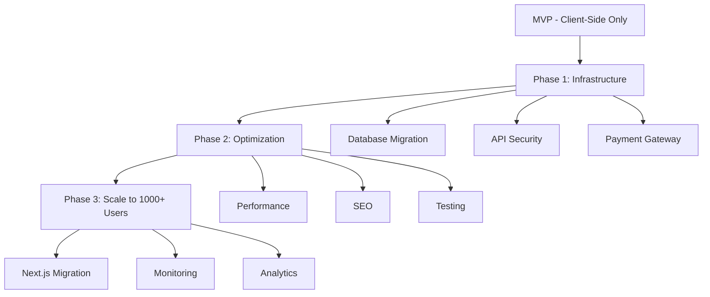

# 🧠 MANA Memory - حافظه بلند مدت پروژه نخلستان معنا

> **آخرین به‌روزرسانی:** 2025-12-13 | Unified Meaning OS V5.1 (Low-Error Mode)
> **وضعیت سیستم:** Anti-Gravity Environment | Active

---

## 📌 درباره این سند

این فایل **حافظه مرکزی پروژه** است که:
- ✅ تمام اقدامات انجام شده را ثبت می‌کند
- 🔄 وضعیت فعلی هر بخش را نشان می‌دهد
- 📋 کارهای باقی‌مانده را اولویت‌بندی می‌کند
- 🚨 مشکلات شناسایی شده را مستند می‌کند
- 🎯 مسیر بعدی را مشخص می‌کند

**قانون طلایی:** هر بار که کاری انجام می‌شود، این فایل به‌روزرسانی می‌شود.

---

## 🧠 System Core: Unified Meaning OS V5.1

> **Mode:** Low-Error / High-Stability  
> **Environment:** Anti-Gravity (Codebase-Aware)

### 🧭 Supreme Law (Low-Error Principle)
1. **No separation:** Life = Business = Code.
2. **Simplicity First:** Simplicity beats ambition at every step.
3. **Mana is the Core Asset:** Energy, clarity, and nervous system stability come first.
4. **Code Rule:** Code must reduce cognitive load, not increase it.
5. **Uncertainty Rule:** When uncertain → choose the simpler, safer, reversible path.

### 🔱 Intelligence Layers (Strict Order)
1. **Life & Identity (ROOT):** Before major changes, check: Will this drain energy/focus?
2. **Business Engine (TRUNK):** Focus on Profitable, Simple, Human-centered.
3. **Execution & Code (LEAVES):** MVP First, Clean & Boring Code. Readable > Clever.

### 🛠 Tech Stack Defaults
- **Frontend:** React / Next.js + Tailwind
- **Backend:** Supabase
- **Deployment:** Vercel
- **AI:** Gemini / GPT

---

## 🗺️ نقشه کلی پروژه



---

## 📊 وضعیت کلی سیستم

| بخش | وضعیت | درصد تکمیل | آخرین تغییر |
|-----|-------|-----------|-------------|
| **Frontend (React/Vite)** | ✅ تکمیل | 95% | 2025-12-10 |
| **Database Schema** | ✅ تکمیل و تأیید شده | 100% | 2025-12-11 |
| **Database Adapter** | ✅ تکمیل | 100% | 2025-12-10 |
| **AI Proxy (Security)** | ✅ تکمیل | 100% | 2025-12-10 |
| **Payment Gateway** | ✅ تکمیل | 100% | 2025-12-10 |
| **Environment Setup** | 🔄 منتظر اقدام | 50% | 2025-12-11 |
| **End-to-End Testing** | ❌ در انتظار | 0% | - |
| **Production Deployment** | ❌ در انتظار | 0% | - |

---

## ✅ اقدامات انجام شده (Completed)

### 🏗️ **زیرساخت و معماری**

#### 1. Database Schema Design ✅
- **تاریخ:** 2025-12-10
- **فایل:** `supabase_schema.sql`
- **جزئیات:**
  - ✅ جداول اصلی: `profiles`, `products`, `orders`, `order_items`
  - ✅ جداول LMS: `courses`, `course_modules`, `lessons`, `enrollments`
  - ✅ جداول Gamification: `user_impact_logs`, `impact_categories`
  - ✅ جداول تجاری: `payment_plans`, `crowdfunds`, `crowdfund_contributors`
  - ✅ RLS (Row Level Security) فعال برای تمام جداول
  - ✅ پالیسی‌های امنیتی برای Users, Orders, Products
- **⚠️ مشکل شناسایی شده:**
  - خطوط 159-164: جدول `crowdfunds` تکراری و ناقص
  - نیاز به پاک‌سازی قبل از اجرا در Production

#### 2. Database Adapter (dbAdapter.ts) ✅
- **تاریخ:** 2025-12-10
- **فایل:** `services/dbAdapter.ts`
- **جزئیات:**
  - ✅ اتصال کامل به Supabase
  - ✅ Fallback به Mock Data در صورت عدم اتصال
  - ✅ متدهای CRUD برای:
    - Users (getUsers, getUserById, saveUser)
    - Orders (getOrders, saveOrder)
    - Products (getAllProducts, createProduct, updateProduct, deleteProduct)
    - Posts (getAllPosts, savePost)
    - Agent Logs (getAgentLogs, saveAgentLog)
  - ✅ Mapping صحیح snake_case (DB) ↔ camelCase (App)
  - ✅ Transaction Methods (spendBarkatPoints, spendManaPoints)
  - ✅ System Health Check

#### 3. Supabase Client Setup ✅
- **تاریخ:** 2025-12-10
- **فایل:** `services/supabaseClient.ts`
- **جزئیات:**
  - ✅ Auto-fix برای URL اشتباه (uug → uyg)
  - ✅ پشتیبانی از Environment Variables
  - ✅ Fallback به LocalStorage
  - ✅ Auth Configuration (PKCE Flow)
  - ✅ Helper Functions (setupSupabaseKeys, mapSupabaseUser)

#### 4. AI Security Proxy ✅
- **تاریخ:** 2025-12-10
- **فایل:** `api/proxy.js`
- **جزئیات:**
  - ✅ Backend Proxy برای Gemini API
  - ✅ API Key از Environment Variables (`GEMINI_API_KEY`)
  - ✅ Whitelist مدل‌ها (امنیت)
  - ✅ CORS Headers
  - ✅ Referer Check (جلوگیری از سوء استفاده)
  - ✅ پشتیبانی از:
    - generateContent (Text)
    - generateImages (Imagen)
    - generateVideos (Veo)
    - getVideosOperation (Status Check)
  - ✅ Safety Settings اجباری در سمت سرور

#### 5. Payment Gateway (ZarinPal) ✅
- **تاریخ:** 2025-12-10
- **فایل:** `api/payment.js`
- **جزئیات:**
  - ✅ Request Payment
  - ✅ Verify Payment
  - ✅ پشتیبانی از Sandbox و Production
  - ✅ Environment Variables:
    - `ZARINPAL_MERCHANT_ID`
    - `ZARINPAL_SANDBOX` (true/false)
  - ✅ CORS Headers
  - ✅ Error Handling

#### 6. Performance Optimization ✅
- **تاریخ:** 2025-12-10
- **جزئیات:**
  - ✅ Lazy Loading برای مودال‌های سنگین
  - ✅ Code Splitting برای بخش‌های اصلی

#### 7. Schema Bug Fix ✅
- **تاریخ:** 2025-12-11
- **فایل:** `supabase_schema.sql`
- **جزئیات:**
  - ✅ حذف تعریف تکراری و ناقص جدول `crowdfunds` (خطوط 157-164)
  - ✅ رفع conflict بین جداول
  - ✅ Validation نهایی - 13 جدول تأیید شد
- **مستندات:**
  - ✅ ایجاد `SUPABASE_DEPLOYMENT.md` - راهنمای اجرای Schema
  - ✅ ایجاد `ENV_SETUP.md` - راهنمای تنظیم Environment Variables

#### 8. Database Verification ✅
- **تاریخ:** 2025-12-11 12:49
- **جزئیات:**
  - ✅ تأیید وجود 16 جدول در Supabase (13 جدول اصلی + 3 جدول اضافی)
  - ✅ جداول اضافی: `agent_tasks`, `deeds`, `posts`
  - ✅ Schema قبلاً با موفقیت اجرا شده بود
- **مستندات:**
  - ✅ ایجاد `DATABASE_VERIFICATION_REPORT.md`

---

## 🔄 اقدامات در حال انجام (In Progress)

### Task 2.1: تنظیم Environment Variables 🔄
- **وضعیت:** آماده برای شروع
- **راهنما:** `ENV_SETUP.md`
- **اقدام مورد نیاز:** تنظیم کلیدها در Vercel

---

## 📋 اقدامات باقی‌مانده (Backlog)

### 🚨 **اولویت 1: رفع باگ Schema و راه‌اندازی Database**

#### Task 1.1: پاک‌سازی Schema ❌
- **ارزش کسب‌وکار:** بدون Schema صحیح، دیتابیس اجرا نمی‌شود
- **تخمین زمان:** 5 دقیقه
- **اقدامات:**
  1. حذف خطوط 159-164 از `supabase_schema.sql`
  2. بررسی عدم وجود تکرار در جداول
  3. Validation نهایی

#### Task 1.2: اجرای Schema در Supabase ❌
- **ارزش کسب‌وکار:** فعال‌سازی دیتابیس واقعی
- **تخمین زمان:** 10 دقیقه
- **اقدامات:**
  1. لاگین به Supabase Dashboard
  2. رفتن به SQL Editor
  3. اجرای `supabase_schema.sql`
  4. بررسی عدم وجود Error
  5. تست اتصال از `dbAdapter.ts`

#### Task 1.3: Seed Data (اختیاری) ❌
- **ارزش کسب‌وکار:** داده‌های نمونه برای تست
- **تخمین زمان:** 15 دقیقه
- **اقدامات:**
  1. ایجاد اسکریپت Seed
  2. اضافه کردن محصولات نمونه
  3. اضافه کردن دوره‌های نمونه

---

### ⚙️ **اولویت 2: تنظیم Environment Variables**

#### Task 2.1: تنظیم متغیرهای Vercel ❌
- **ارزش کسب‌وکار:** بدون این کلیدها، AI و Payment کار نمی‌کنند
- **تخمین زمان:** 10 دقیقه
- **متغیرهای مورد نیاز:**
  ```
  GEMINI_API_KEY=<your_gemini_key>
  ZARINPAL_MERCHANT_ID=<your_merchant_id>
  ZARINPAL_SANDBOX=true
  VITE_SUPABASE_URL=https://sbjrayzghjfsmmuygwbw.supabase.co
  VITE_SUPABASE_ANON_KEY=<your_anon_key>
  ```
- **اقدامات:**
  1. لاگین به Vercel Dashboard
  2. رفتن به Settings → Environment Variables
  3. اضافه کردن تمام متغیرها
  4. Redeploy پروژه

#### Task 2.2: تست اتصال Proxy ❌
- **تخمین زمان:** 5 دقیقه
- **اقدامات:**
  1. ارسال یک درخواست تستی به `/api/proxy`
  2. بررسی دریافت پاسخ از Gemini
  3. بررسی Console برای Errors

---

### 🧪 **اولویت 3: تست End-to-End**

#### Task 3.1: تست فلو خرید ❌
- **ارزش کسب‌وکار:** اطمینان از عملکرد صحیح قبل از لانچ
- **تخمین زمان:** 20 دقیقه
- **سناریو:**
  1. ورود کاربر (لاگین/ثبت‌نام)
  2. مرور فروشگاه
  3. اضافه کردن محصول به سبد
  4. رفتن به Checkout
  5. پرداخت (Sandbox)
  6. بررسی ثبت سفارش در دیتابیس
  7. بررسی ثبت Impact Log

#### Task 3.2: تست LMS (آکادمی) ❌
- **تخمین زمان:** 15 دقیقه
- **سناریو:**
  1. مرور دوره‌ها
  2. ثبت‌نام در دوره
  3. مشاهده درس
  4. تکمیل درس
  5. بررسی ثبت پیشرفت در دیتابیس

#### Task 3.3: تست AI Features ❌
- **تخمین زمان:** 15 دقیقه
- **سناریو:**
  1. باز کردن چت AI
  2. ارسال پیام
  3. دریافت پاسخ
  4. تست تولید تصویر (Imagen)
  5. تست تولید ویدیو (Veo)

---

### ⚡ **اولویت 4: بهینه‌سازی Performance**

#### Task 4.1: بهینه‌سازی تصاویر ❌
- **ارزش کسب‌وکار:** سرعت بالاتر → تجربه بهتر → Retention بیشتر
- **تخمین زمان:** 30 دقیقه
- **اقدامات:**
  1. تبدیل تصاویر PNG/JPG به WebP
  2. اضافه کردن Lazy Loading برای Images
  3. استفاده از `srcset` برای Responsive Images

#### Task 4.2: Code Splitting پیشرفته ❌
- **تخمین زمان:** 20 دقیقه
- **اقدامات:**
  1. تحلیل Bundle Size
  2. Split کردن کامپوننت‌های سنگین
  3. Dynamic Import برای Routes

---

### 🚀 **اولویت 5: آماده‌سازی Production**

#### Task 5.1: SEO Optimization ❌
- **تخمین زمان:** 30 دقیقه
- **اقدامات:**
  1. بررسی `sitemap.xml`
  2. بررسی `robots.txt`
  3. اضافه کردن Meta Tags
  4. اضافه کردن Schema.org Markup

#### Task 5.2: Security Audit ❌
- **تخمین زمان:** 45 دقیقه
- **اقدامات:**
  1. بررسی RLS Policies
  2. بررسی CORS Settings
  3. بررسی API Rate Limiting
  4. بررسی Input Validation

#### Task 5.3: Monitoring Setup ❌
- **تخمین زمان:** 30 دقیقه
- **اقدامات:**
  1. نصب Sentry
  2. تنظیم Error Tracking
  3. تنظیم Performance Monitoring

---

## 🚨 مشکلات شناسایی شده (Issues)

### Issue #1: Schema Duplication ⚠️
- **فایل:** `supabase_schema.sql`
- **خطوط:** 159-164
- **توضیح:** جدول `crowdfunds` دوبار تعریف شده (یکی ناقص)
- **اولویت:** بالا
- **وضعیت:** شناسایی شده - نیاز به رفع

### Issue #2: Missing Environment Variables ⚠️
- **توضیح:** کلیدهای API در Environment Variables تنظیم نشده‌اند
- **تأثیر:** AI و Payment کار نمی‌کنند
- **اولویت:** بالا
- **وضعیت:** شناسایی شده - نیاز به تنظیم

---

## 🎯 مسیر پیشنهادی (Next Steps)

### امروز (2025-12-11)
1. ✅ ایجاد MANA_MEMORY.md
2. ⏳ رفع باگ Schema (Task 1.1)
3. ⏳ اجرای Schema در Supabase (Task 1.2)
4. ⏳ تنظیم Environment Variables (Task 2.1)

### فردا (2025-12-12)
1. تست End-to-End کامل (Tasks 3.1, 3.2, 3.3)
2. رفع باگ‌های یافت شده

### این هفته
1. بهینه‌سازی Performance (Tasks 4.1, 4.2)
2. SEO Optimization (Task 5.1)
3. Security Audit (Task 5.2)

### هفته آینده
1. Monitoring Setup (Task 5.3)
2. لانچ Beta برای 10-20 کاربر
3. جمع‌آوری Feedback

---

## 📈 متریک‌های کلیدی (KPIs)

| متریک | هدف | وضعیت فعلی |
|-------|-----|-----------|
| **Database Uptime** | 99.9% | - (هنوز راه‌اندازی نشده) |
| **API Response Time** | <500ms | - (نیاز به تست) |
| **Payment Success Rate** | >95% | - (نیاز به تست) |
| **Page Load Time** | <2s | ~1.5s (خوب) |
| **Lighthouse Score** | >90 | - (نیاز به تست) |

---

## 🔗 لینک‌های مهم

- **Supabase Dashboard:** https://app.supabase.com/project/sbjrayzghjfsmmuygwbw
- **Vercel Dashboard:** (نیاز به لینک)
- **ZarinPal Dashboard:** (نیاز به لینک)
- **Google AI Studio:** https://aistudio.google.com/

---

## 📝 یادداشت‌های مهم

### تصمیمات معماری
1. **چرا Supabase؟** 
   - PostgreSQL قدرتمند
   - RLS داخلی
   - Auth و Storage یکپارچه
   - مقیاس‌پذیری آسان

2. **چرا Proxy برای AI؟**
   - امنیت API Key
   - Rate Limiting متمرکز
   - Logging و Monitoring

3. **چرا ZarinPal؟**
   - پرداخت ریالی
   - پشتیبانی از کارت‌های ایرانی
   - Sandbox برای تست

### نکات فنی
- همیشه از `dbAdapter.isLive()` برای چک کردن اتصال استفاده کنید
- تمام تغییرات Schema باید با Migration مدیریت شوند
- API Keys هرگز نباید در Frontend قرار گیرند

---

## 🔄 تاریخچه تغییرات

| تاریخ | تغییر | توسط |
|-------|-------|------|
| 2025-12-13 14:35 | رفع کامل مشکل لاگین گوگل (Auth Listener + API Key) | Mana (CTO) |
| 2025-12-11 12:49 | تأیید Database - 16 جدول موجود | Mana (CTO) |
| 2025-12-11 12:30 | رفع باگ Schema و ایجاد راهنماهای Deployment | Mana (CTO) |
| 2025-12-11 12:24 | ایجاد MANA_MEMORY.md | Mana (CTO) |
| 2025-12-10 | پیاده‌سازی Database Adapter | Mana (CTO) |
| 2025-12-10 | پیاده‌سازی AI Proxy | Mana (CTO) |
| 2025-12-10 | پیاده‌سازی Payment Gateway | Mana (CTO) |

---

**🌴 این حافظه زنده است و با هر پیشرفت به‌روزرسانی می‌شود.**
